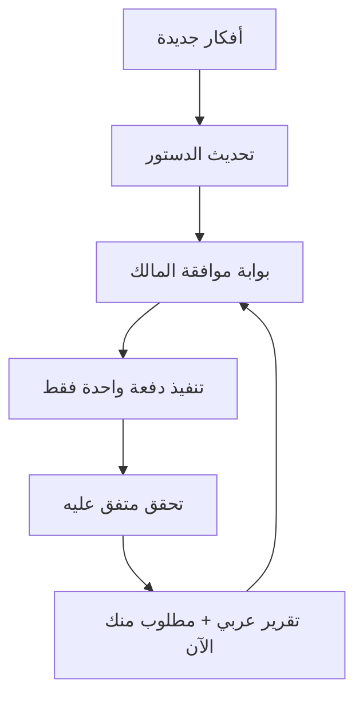

<!--
SNAPSHOT: دستور خطة عربية/Contabo — نسخة كاملة محفوظة محلياً في المستودع
تاريخ اللقطة: 2026-08-22
المصدر: خطة الوكيل الحية (Cloud Agent)
الغرض: مرجع ثابت بينما ننتقل لتنفيذ بوابة الحماية العاجلة
ملاحظة: هذه نسخة محلية في docs/plans — لا تُنشر إلى Contabo كإعداد تشغيل
-->

---
name: Arabya Contabo Recovery
overview: 'دستور خطة حية: Contabo + تدقيقات سابقة + saga 8092/CSP (#150/#154/#157) — عكس التعريض العام لاحقاً مع الإبقاء على التوصيل وCSP.'
todos:
  - id: gov-contract
    content: دستور الموافقة الصريحة خطوة بخطوة (لا تنفيذ بلا إذن)
    status: completed
  - id: contabo-readonly
    content: فحص Contabo قراءة فقط مكتمل (SSH root)
    status: completed
  - id: audit-handoff-review
    content: مراجعة تقرير تدقيق أغسطس 2026 ومصفوفة نضيف/لا نضيف
    status: completed
  - id: prelaunch-7-review
    content: مراجعة قائمة Pre-Launch السبعة والتحقق الحي + مصفوفة القرار
    status: completed
  - id: lughawi-handoff-164
    content: مراجعة تسليم لغوي/#164/#168/#181 والتحقق الحي للجملة السياقية
    status: completed
  - id: handoff-8092-csp
    content: مراجعة saga 8092/CSP (#150/#154/#157) وقرار عكس التعريض العام
    status: completed
  - id: owner-ideas-auto
    content: استلام قرار المالك — قواعد سريعة كافية أم Ollama opt-in؟ + أفكار مسار Auto/الرسالة الصفراء
    status: pending
  - id: owner-choose-next-gate
    content: اختيار المالك للبوابة التالية (حماية منافذ/.env / قرار Ollama / Rocket Loader / SFTP…)
    status: pending
  - id: urgent-sec-propose
    content: 'بعد موافقة: حماية عاجلة (.env + إغلاق 8092 + bind 127.0.0.1 + تصحيح وثيقة/سكربت #150) مع الإبقاء على #154 و#157'
    status: pending
  - id: batch-backup-wal
    content: 'بعد موافقة: سكربت نسخ SQLite مع WAL (user-data + arabya-nlp) وcron آمن'
    status: pending
  - id: batch-sandbox-review
    content: 'بعد موافقة: تشديد SAFE_ACTIONS مع بقاء AUTO_EXECUTE=0'
    status: pending
  - id: batch-restart-script
    content: 'بعد موافقة: سكربت طوارئ restart-platform.sh بحذر'
    status: pending
  - id: batch-lughawi-seo
    content: 'بعد موافقة المالك على نص الكلمات المفتاحية: تحديث meta لغوي'
    status: pending
  - id: batch1-lughawi
    content: 'بعد موافقة: دفعة كود مسار لغوي/Auto (بدون إعادة اختراع #164/#154)'
    status: pending
  - id: batch2-security-code
    content: 'بعد موافقة: حماية كود (ضيف-SQLite / Banned / sync) + بقايا تدقيق H-03/wrangler'
    status: pending
  - id: batch3-ops
    content: 'بعد موافقة: استقرار Contabo + مقارنة #168/#171 مع main قبل أي دمج'
    status: pending
  - id: batch4-pr-hygiene
    content: 'بعد موافقة صريحة: تنظيف PRs القديمة (#171/#168/#163/#167/#137)'
    status: pending
  - id: owner-cloudflare-rocket
    content: 'بعد موافقة: خطوات مالك كاملة لإيقاف Cloudflare Rocket Loader'
    status: pending
isProject: false
---
# دستور خطة عربية / Contabo (وثيقة حية)

## أين نحن الآن
- **لقطة محفوظة محلياً:** 2026-08-22 — الملف في `docs/plans/arabya-contabo-recovery-constitution-ar.md`.
- **الانتقال:** المالك طلب إيقاف توسعة الخطة مؤقتاً والبدء بـ **البوابة A — الحماية العاجلة** ثم إصلاح الأخطاء؛ تطوير الخدمات لاحقاً.
- تم سابقاً: فحص Contabo · تدقيق أغسطس · Pre-Launch · تسليم لغوي/#164/#181 · saga 8092/CSP · خريطة المحركات.
- الحي عند اللقطة: `/` و`/lughawi` = 200؛ CSP فيه `unsafe-inline`؛ القواعد تعمل؛ NLP على `0.0.0.0:8092` مكشوف؛ `.env` بصلاحية 644 مقروء من مستأجرين.
- مبدأ دستوري: **إبقاء #154 و#157** · **عكس مقايضة #150** بعد موافقة · Ollama/Alnnahwi opt-in فقط.
- مرفوض بلا إذن: تعريض Nginx لـ8092 · `ARABYA_NLP_URL` عام · تفعيل Ollama · إزالة `unsafe-inline` فجأة.

---

## دستور الإرشادات (ملزم في كل خطوة)

### أ) علاقة الوكيل بالمالك
1. المالك ليس مبرمجاً — كل إجراء يُشرح بعربية مبسطة.
2. **اسأل في كل خطوة** قبل التنفيذ؛ لا تدمج خطوات خطرة.
3. إن احتجت عملاً من المالك: اكتب **خطوات كاملة مرقّمة** (PuTTY / لوحة / روابط) وليس ملخصاً.
4. كل رد تنفيذي يبدأ بـ «أين نحن في الدستور» وينتهي بـ **«مطلوب منك الآن»**.
5. الخطة وثيقة حية: أفكار جديدة تُدمج هنا **قبل** أي برمجة.

### ب) محظورات بلا موافقة صريحة
- `systemctl` لأي خدمة (خصوصاً Ollama)
- تعديل `.env` / أسرار / UFW / فتح أو إغلاق منافذ
- `pm2 restart/stop/delete` على Contabo
- حذف قفل النشر أو تشغيل `contabo-deploy.sh`
- دمج/إغلاق PRs أو دفع إلى `main`
- تدوير مفاتيح أو تغيير كلمات مرور نيابة عن المالك
- تشغيل قوالب استعادة 503 الكاملة دون أن يطلبها المالك وحالة 503 قائمة

### ج) ثوابت المنتج (لا تُكسر)
1. الإنتاج = **Contabo فقط** (`arabya.org`) — لا Vercel كمسار إنتاج.
2. قراءة المصحف/الدراسة للضيف **بدون** تسجيل.
3. تسجيل الدخول = Google OAuth؛ الفوترة مؤجلة.
4. الأدوار في الكود الحالي: `admin` · `editor` · `creator` · `member` (+ ضيف). الاسم القديم `user` يُطبَّع إلى `member`.
5. بيانات شخصية = SQLite Contabo عبر `scripts/contabo-ensure-dbs.sh`.
6. محتوى قرآن/حديث/تراث = Git تحت `/data`.
7. هوية UI: teal + RTL عربية.
8. تشغيل الويب: `pm2 start deploy/contabo/ecosystem.config.cjs` — **ليس** `pm2 start arabya-web` كمسار سكربت.
9. لا `npx next` على السيرفر.
10. لا تنشر Contabo بينما المالك يشغّل `npm install` يدوياً في نفس الوقت.
11. **معمارية لغوي:** المتصفح → فقط `POST /api/lughawi/proofread` → Next → `ARABYA_NLP_URL=http://127.0.0.1:8092`. المتصفح **لا** يرى `:8092`.
12. **ممنوع:** `ARABYA_NLP_URL=https://arabya.org` (حلقة/404) · تعريض `:8092` عبر Nginx/OLS للعامة.
13. قواعد Contabo (TS + PyArabic/ghalatawi/inna) = الأساس السريع دائمًا؛ Ollama المحلي = **opt-in بموافقة صريحة فقط** (`LUGHAWI_LOCAL_OLLAMA=1` + `ARABYA_NLP_LLM_PROOFREAD=1`).
14. لا تُعد كتابة إصلاحات spans/#164 إن كانت على main (موجودة ومؤكدة حيّاً).
15. **CSP:** الإبقاء على `script-src … 'unsafe-inline'` حالياً (#157) حتى توجد خطة nonces مُختبَرة على Contabo — لا تُزل `unsafe-inline` فجأة (صفحة بيضاء).
16. **ServerAvatar:** Fail2Ban و«8G Firewall» في شاشة التطبيق **ليست** جدار منافذ TCP؛ اترك 8G Disabled؛ لا تُشخَّص كـ«اختطاف» لمنفذ 8092.
17. فحص صحة NLP محلياً: الرابط الكامل `http://127.0.0.1:8092/health` (وليس `http://127.0.0` المقطوع).
18. منجز #154 (توصيل proofread→NLP) يبقى؛ مقايضة #150 (UFW allow + bind `0.0.0.0`) تُعكس بعد موافقة لأنها غير لازمة بعد التوصيل الداخلي.

### د) ترتيب الأولويات الدستوري (بعد موافقة كل بوابة)
1. **حماية Contabo الحرجة الحالية** (`.env` مقروء + `8092` عام) — أعلى من تنظيف PRs ومن CSP الاختياري.
2. **مسار لغوي / Auto** حسب أفكار المالك (بديل عن 1/2/3).
3. **حماية كود التطبيق** المكتشفة في فحصنا (ضيف-SQLite، Banned، sync…).
4. **بقايا تدقيق أغسطس** (H-03 CSP، wrangler، وثيقة قديمة) — لاحقاً.
5. **نظافة تشغيل** (PRs قديمة، stash، WAL backup، Node 22 اختياري).



---

## تأكيد الصلاحيات (حي)
| البند | النتيجة |
|--------|---------|
| SSH | ناجح بمفتاح الوكيل |
| المستخدم | `root` — صلاحيات كاملة |
| الاستخدام الفعلي حتى الآن | **قراءة فقط** رغم القدرة على الكتابة |
| الالتزام | لا تغيير بلا موافقة صريحة |

---

## تقرير Contabo الحي (مختصر — ما زال سارياً)
- الخدمات: `arabya-web` ~1GB / `arabya-nlp` ~200MB / `lughawi-sidecar` ~21MB — online
- Ollama: disabled/inactive؛ نماذج على القرص؛ `LUGHAWI_OLLAMA_BASE_URL` ما زال في `.env` → يدخل بركة Auto
- Proofread ضيف: `احمد→أحمد` ~3.1ث؛ بدون رسالة صفراء للضيف
- RAM مرتاح الآن؛ swap كبير موجود
- **CRITICAL:** `.env*` بصلاحية 644 ومقروءة من مستأجر ServerAvatar آخر
- **CRITICAL:** `8092` مفتوح UFW للعامة + docs/dashboard
- MEDIUM: 18 stash؛ package-lock متسخ؛ نسخ SQLite بدون WAL؛ sidecar `.venv` 5.5G

---

## مراجعة تقرير الوكيل السابق (تدقيق أغسطس 2026) — تحقق حي

### ما تأكد أنه صحيح الآن
| ادّعاء التقرير | تحققنا |
|----------------|--------|
| الموقع حي ومعظم الصفحات 200 | نعم — أعيد فحص `/` `/mushaf/1` `/services` `/adhkar` `/lughawi` `/admin` `/account` `/studio` `/robots.txt` `/sitemap.xml` `/about` `/hadith` `/heritage` `/qibla` |
| آخر Deploy Contabo نجاح على `fe12f45` | نعم |
| CI ناجح على دفعات #181 | نعم |
| ترويسات أمان موجودة (HSTS/CSP/XFO/nosniff/Referrer/Permissions) | نعم على الحي |
| `/studio` فيه `noindex, nofollow` | نعم (meta في HTML) |
| robots: Cloudflare Managed + Disallow لـ `/api/` `/admin/` `/account/` `/studio/` + Sitemap | نعم |
| CSP ما زال `unsafe-inline` في script-src (H-03 غير مغلق) | نعم — مؤكد في `next.config.ts` والحي |
| arabyaai.com جسر/بروكسي وليس redirect صارم | نعم — ترويسة `x-arabya-bridge: arabyaai-proxy` |
| H-01 exceljs بدل xlsx | نعم — لا `xlsx` في الاعتماديات |
| H-05 أدمن من `ARABYA_ADMIN_EMAILS` في التطبيق | نعم في `src/lib/roles.ts`؛ وموجود على Contabo `.env` |
| بقايا إيميلات في `workers/arabya-sync/wrangler.toml` | نعم ما زالت |
| مقاومة 503 عبر تثبيت ذرّي + prev-good على main (#174+) | نعم داخل `scripts/contabo-deploy.sh` |
| PRs قديمة مفتوحة: #171/#168/#167/#163 drafts متعارضة؛ #137 | نعم |
| وثيقة `audit-2026-08-remediation-ar.md` تقول أُزيل unsafe-inline من scripts | **خاطئة/قديمة** — الواقع عكس ذلك |

### ما في التقرير صار قديماً أو ناقصاً مقارنة بخطتنا الحالية
| نقطة | الحكم |
|------|--------|
| أولوية P1 = إغلاق PRs فوراً | **أضعف من** ثغرات `.env`/`8092` التي اكتشفناها لاحقاً |
| قالب استعادة 503 جاهز للتنفيذ الآن | الموقع **ليس** في 503 — القالب مرجع طوارئ فقط |
| أدوار `admin/editor/user` | الكود الحقيقي: `member/creator/editor/admin` |
| `contabo-recover-web.sh` كأنه متوفر | **غير موجود على main** — موجود فقط داخل فرع PR #171 |
| «لا حاجة لـ PuTTY والموقع يعمل» | صحيح للوضع العام؛ لكن حماية `.env`/`8092` قد تحتاج خطوات مالك لاحقاً |
| لم يذكر أزمات لغوي/Ollama/الرسالة الصفراء | تقرير أقدم جزئياً عن خيط التدقيق — خطتنا الحالية أغنى هنا |

---

## مصفوفة القرار: ماذا نضيف للخطة؟ وماذا لا نضيف؟

### نُضيف (مع التعليل)

| البند | لماذا نضيفه |
|--------|-------------|
| ثوابت المنتج + قواعد تشغيل PM2/`npx next`/عدم تداخل Deploy مع npm يدوي | دستور تشغيلي يمنع تكرار كوارث 503 |
| حالة تدقيق H-01..H-05 كسجل حقيقة محدَّث | يمنع إعادة اختراع المنجز ويوضح المتبقي |
| H-03 CSP (لاحقاً، بحذر، مع خطة عدم إفراغ الصفحات) | متبقٍ موثّق؛ فشل سابقاً على Contabo |
| تصحيح وثيقة `audit-2026-08-remediation-ar.md` بشأن CSP | الوثيقة حالياً مضلّلة |
| بقايا wrangler admin emails → أسرار Cloudflare (لاحقاً) | بقايا H-05 حقيقية؛ العامل D1 ثانوي لكنه دين تقني |
| تنظيف PRs #171/#163/#167/#168/#137 **بعد موافقة** | مسودات متعارضة/قديمة تسبب تشويشاً |
| استخراج محتمل لـ `contabo-recover-web.sh` من #171 قبل الإغلاق إن وافقت | السكربت غير موجود على main؛ قد يكون مفيداً للطوارئ |
| سؤال المالك عن تغيير كلمة SFTP (عنصر واحد) | بند تدقيق لم يُغلق؛ يخص المالك فقط |
| Node 22 اختياري لاحقاً | يقلل مشاكل npm على Node 24؛ ليس عاجلاً والسيرفر الآن v24 ومستقر نسبياً |
| قالب استعادة 503 **كمرجع طوارئ داخل الدستور** لا كخطوة الآن | مفيد إن عاد العطل؛ ممنوع تشغيله والوضع سليم |
| redirect صارم arabyaai→arabya (اختياري لاحقاً) | اليوم جسر يعمل؛ التحويل الصارم قرار منتج منك |
| Redis rate-limit (مؤجّل بعيد) | مذكور كمؤجّل عمداً؛ نبقيه في القائمة الخلفية فقط |

### لا نُضيف كعمل فوري / أو نرفض تبنّي أولوية التقرير كما هي

| البند | لماذا لا نضيفه الآن / لا نتبنّاه كأولوية |
|--------|------------------------------------------|
| بدء العمل بـ P1 إغلاق PRs فوراً | أولويتنا الدستورية = حماية الأسرار والمنفذ 8092 ثم لغوي حسب أفكارك |
| إعادة تنفيذ إصلاحات exceljs / studio noindex / أدمن env / `/services` / لغوي #176–#181 | منجزة على main — نتحقق فقط عند الحاجة |
| إعادة محاولة CSP الصارم فوراً | سبق أن أفرغ صفحات Contabo؛ يحتاج بوابة منفصلة وخطة nonces |
| تشغيل قالب استعادة 503 الآن | لا يوجد 503 حي؛ خطر إيقاف خدمات بلا داعٍ |
| فرض Node 22 الآن | تغيير كبير على السيرفر؛ يحتاج موافقتك واختبار نشر |
| Dependabot #18/#19/#69 وPR #83/#92 ضمن هذه الخطة | خارج نطاق التعافي الحالي إلا إذا طلبت صراحة |
| اعتبار تقرير أغسطس «مصدراً وحيداً للحقيقة» | أقدم من اكتشافاتنا الحية (Ollama/Auto/`.env`/8092) — يُدمج بعد التحقق لا يستبدل خطتنا |
| الخيار 1/2/3 للغوي من الوكيل الأحدث | رفضتها مسبقاً — لا تُعاد إدراجها كحلول معتمدة |
| إعادة تفعيل Ollama ضمن بنود تقرير التدقيق | غير مذكور كواجب هناك؛ وعندنا محظور بلا موافقة |

### نُبقي كما هو من خطتنا الحالية (لا يغيّره تقرير أغسطس)
- عقد الموافقة الصريحة وعدم التصرف بلا إذن
- CRITICAL: صلاحيات `.env` + إغلاق 8092
- فجوة Auto + `LUGHAWI_OLLAMA_BASE_URL` + Google 503 + الرسالة الصفراء
- حماية كود: ضيف-SQLite / Banned / sync / JWT lag
- انتظار أفكارك لمسار لغوي جديد

---

## خارطة البوابات (كل بوابة = سؤال + موافقة قبل التنفيذ)

### البوابة A — حماية Contabo العاجلة (موصى بها أولاً بعد أفكارك أو معها)
عند الموافقة فقط سأعرض لك قبل التنفيذ:
1. ماذا سأغيّر بالضبط (أوامر `chmod` / UFW / bind)
2. المخاطر (قطع مؤقت؟ هل يؤثر على لوحة NLP؟)
3. خطوات تحقق بعد التنفيذ
4. إن لزم تدوير مفاتيح: خطوات كاملة لك في لوحات Google/OpenRouter

### البوابة B — مسار لغوي / Auto (بانتظار أفكارك)
لا تصميم نهائي قبل رسائلك. بعدها نحدّث الدستور ثم نعرض دفعة كود للموافقة.

### البوابة C — تنظيف GitHub PRs
بعد موافقتك فقط. قبل إغلاق #171: نقرر معاً هل نستخرج `contabo-recover-web.sh` إلى main أم لا.

### البوابة D — سؤال SFTP (عمل من طرفك فقط)
عند اختيار هذه البوابة سأعطيك خطوات كاملة لتغيير كلمة SFTP من لوحة ServerAvatar (لا أنفّذها أنا).

### البوابة E — بقايا تدقيق (CSP / wrangler / وثيقة / redirect arabyaai)
لاحقاً وبعد استقرار A+B.

### البوابة F — طوارئ 503 فقط إذا وقع العطل مجدداً
مرجع الأوامر موجود في تقرير أغسطس؛ لا يُشغَّل الآن.

---

## سجل بنود التدقيق (مصدر حقيقة محدَّث)

| البند | الحالة الآن |
|--------|-------------|
| H-01 xlsx→exceljs | مكتمل |
| H-02 robots/SEO/studio noindex | مكتمل عملياً |
| H-03 CSP بلا unsafe-inline للسكربت | **غير مكتمل** (ومتعمّد حالياً لتجنب الصفحة البيضاء) |
| H-04 trust proxy | مكتمل في الكود |
| H-05 أدمن من env (التطبيق) | مكتمل؛ بقايا wrangler |
| مقاومة 503 (#174+) | محسّنة؛ Deploy ناجح |
| كلمة SFTP | غير مؤكد منك |
| Node 22 | اختياري لاحقاً |
| ثغرة `.env` world-readable على VPS مشترك | **جديدة — حرجة — غير مغلقة** |
| ثغرة 8092 عام | **جديدة — حرجة — غير مغلقة** |
| رسالة Auto الصفراء / بركة Ollama المتوقفة | **مفتوحة — بانتظار مسارك** |

---

## مراجعة قائمة Pre-Launch السباعية (وكيل سابق) — تحقق حي + قرار

> ملاحظة دستورية: النص الإنجليزي في نهاية ذلك التقرير يطلب تنفيذ 3 بنود **فوراً**. هذا **مرفوض**. البنود تُحوَّل إلى بوابات موافقة فقط.

### تحقق سريع لكل بند

| # | ادّعاء الوكيل السابق | الواقع المؤكد الآن | الحكم |
|---|----------------------|---------------------|--------|
| 1 | أغلق 8092 و11434 عن العالم؛ localhost فقط | **8092 مفتوح للعامة** (UFW allow + bind `0.0.0.0` + health عام=200). **11434 غير مستمع** لأن Ollama inactive/disabled؛ غير مفتوح في UFW حالياً. 8091 على localhost فقط (جيد). منفذ إضافي مفتوح: **43210** (ServerAvatar agent) | نُبقي/ نوسّع **البوابة A** (حماية منافذ) — أولوية حرجة |
| 2 | `ARABYA_NLP_DEVOPS_AUTO_EXECUTE=1` ويجب تضييق SAFE_ACTIONS | على الحي: **`AUTO_EXECUTE=0`** (آمن أكثر مما ادّعى). `command_sandbox.py` whitelist فقط؛ **لا `rm -rf` عام**. يوجد `clear_nlp_tmp` = `find … -delete` داخل `/tmp/arabya-nlp` فقط، و`restart_ollama` / `restart_pm2_web` | نُضيف مراجعة تشديد اختيارية لاحقاً؛ **لا نفعّل AUTO_EXECUTE=1** بلا إذن |
| 3 | نسخ يومي لـ `arabya-nlp.sqlite` مضغوط | cron الحالي ينسخ **`user-data.sqlite` فقط** بـ `cp` الساعة 03:00 **بدون WAL وبدون arabya-nlp وبدون ضغط** | نُضيف بوابة نسخ محسّنة (بعد موافقة) |
| 4 | حد الزائر 5 طلبات/ساعة ويجب معايرته مع llama | الحي: **`RATE_LIMIT_REQUESTS=100000`/ساعة**؛ LLM المحلي **OFF**. توثيق `.env.example`/README ما زال يذكر 5 (قديم). لا حاجة لمعايرة llama الآن لأن Ollama متوقف | لا نرجع إلى 5 الآن؛ قرار الرقم = قرار مالك لاحقاً بعد استقرار Auto |
| 5 | راقب Sentry 24 ساعة | مفاتيح/DSN Sentry **موجودة** في `.env` على Contabo | عمل **من طرفك** (مراقبة بشرية) — لسنا ننفّذ شيئاً على السيرفر |
| 6 | SEO لغوي بكلمات تسويقية محددة | الصفحة لها meta موجودة: عنوان «لغوي · المدقق اللغوي العربي الفصيح» ووصف فصيح أكاديمي — **ليست** نفس صياغة «أقوى مدقق…» المقترحة | نُضيف فقط بعد موافقتك على **نص حرفي** جديد |
| 7 | اكتب `restart-platform.sh` فوراً | **غير موجود** في المشروع حالياً | نُضيف كبوابة لاحقة بحذر (ecosystem فقط؛ لا `npx next`؛ لا إعادة Ollama بلا إذن) |

### نُضيف للدستور (مع التعليل)

| البند | لماذا |
|--------|--------|
| البوابة A موسَّعة: إغلاق 8092 للعامة + منع فتح 11434 + ideally bind NLP إلى `127.0.0.1` + صلاحيات `.env` | يطابق حاجتنا الحرجة المكتشفة سابقاً ويصحّح البند 1 |
| توثيق أن 11434 حالياً مغلق عملياً لأن الخدمة متوقفة | حتى لا يُفهم أن Ollama «يعمل على 11434» كما في التقرير القديم |
| بوابة نسخ احتياطي: `user-data` + `arabya-nlp` مع checkpoint/WAL + ضغط + مجلد معزول + احتفاظ أيامي | البند 3 صحيح كحاجة؛ التنفيذ الحالي ناقص |
| مراجعة SAFE_ACTIONS لاحقاً (إبقاء AUTO_EXECUTE=0؛ سؤال المالك عن الإبقاء على `restart_ollama` و`clear_nlp_tmp`) | البند 2 مفيد جزئياً رغم أن ادّعاء التفعيل=1 خاطئ |
| بوابة `restart-platform.sh` طوارئ بعد موافقة (أوامر آمنة فقط) | البند 7 مفيد كمرجع مالك؛ يُصمم ليتوافق مع دستور PM2 |
| بوابة SEO لغوي بعد اعتماد نصك حرفياً | البند 6 قرار تسويقي منك لا صياغة مفروضة |
| قائمة مراقبة Sentry 24 ساعة كخطوات لك | البند 5 عمل بشري من المالك |

### لا نُضيف / لا ننفّذ كما طلب التقرير

| البند | لماذا لا |
|--------|----------|
| «Generate hardened script / review sandbox / build backup **now**» | يخالف دستور الموافقة الصريحة |
| افتراض أن Ollama يعمل ويستهلك الرام الآن لمعايرة rate limit | Ollama متوقف؛ Local LLM flags = 0 |
| إعادة ضبط الحد إلى 5 طلبات/ساعة الآن | الحي على 100000 عمداً بعد مشاكل false-429؛ الرجوع يحتاج قرارك بعد فهم المسار السحابي |
| تفعيل `ARABYA_NLP_DEVOPS_AUTO_EXECUTE=1` | التقرير يدّعي أنه مفعّل؛ الواقع=0 وهذا أفضل حتى تقرر أنت |
| حذف `restart_ollama` من الـwhitelist فوراً بدون سؤالك | قد تحتاجه لاحقاً؛ نبقيه للموافقة |
| فرض كلمات SEO التسويقية («أقوى مدقق…») دون موافقتك | قد لا تناسب نبرة عربية الأكاديمية الحالية |
| إغلاق منفذ 43210 (ServerAvatar) ضمن هذه الخطة دون إذنك | خارج تطبيق عربية؛ قرار استضافة منفصل |
| إرسال النسخ الاحتياطية للبريد تلقائياً كجزء إلزامي الآن | تعقيد أسرار SMTP؛ نبدأ بمجلد محلي معزول ثم نقرر البريد لاحقاً إن طلبت |

### ترتيب موصى به بعد موافقاتك (لا يُنفَّذ وحده)
1. حماية منافذ + `.env` (A)
2. أفكارك لمسار لغوي/Auto ثم الكود
3. نسخ احتياطي WAL/ضغط
4. مراجعة sandbox (مع إبقاء AUTO_EXECUTE=0)
5. سكربت طوارئ restart
6. SEO نصّي إن اعتمدت الصياغة
7. Sentry مراقبة من طرفك بالتوازي

---

## مراجعة تسليم لغوي / Contabo (#164 / #168 / #181) — تحقق حي + قرار

### ما تأكد أنه صحيح الآن
| ادّعاء | تحققنا |
|--------|--------|
| الموقع و`/lughawi` = 200 | نعم |
| الجملة السياقية تُصحَّح وتُلوَّن | نعم حيّاً: `المعلمون→المعلمين` (`inna-nasb`) و`لاكن→لكن` (`hamza-ana`) بمواضع غير صفرية |
| المسار عبر `/api/lughawi/proofread` لا عبر متصفح→8092 | نعم (معمارية صحيحة في الكود) |
| #164 مدمج (`58b581b`) وإصلاح spans/inna على main | نعم — `remap_edits_to_original` + `inna-nasb` + zero-span fallback في enrich |
| #181 عطّل Ollama افتراضياً | نعم؛ Contabo: `LUGHAWI_LOCAL_OLLAMA=0` و`ARABYA_NLP_LLM_PROOFREAD=0`؛ المرحلة `llm-skipped` |
| #168 DRAFT متعارض وغير مدمج؛ `contabo-recover-web.sh` ليس على main | نعم |
| طلب تعريض 8092 عبر Nginx + `ARABYA_NLP_URL=https://arabya.org` يجب رفضه | **نؤكده دستورياً** — صحيح أمنياً ومعمارياً |
| التشخيص أن الرسالة الحمراء كانت من بطء Ollama + spans 0:0 | منطقي تاريخياً؛ #164 عالج الـspans؛ #181 أوقف البطء الافتراضي |

### تعارض مهم مع خطتنا / الواقع الحي (لا يتجاهل)
| نقطة | التفصيل |
|------|---------|
| التقرير يقول «لا تفتح 8092» | صحيح كقرار منتج — **لكن** السيرفر الحي **مفتوح فعلاً** عبر UFW + `0.0.0.0` (اكتشفناه سابقاً) |
| وثيقة `docs/platform/arabya-nlp-port-8092-ar.md` | **متناقضة**: أعلى الصفحة يمنع التعريض العام، ثم تعطي أوامر `ufw allow 8092` و`ARABYA_NLP_HOST=0.0.0.0` وتتوقع وصولاً خارجياً. سكربت `contabo-arabya-nlp-firewall.sh` يغذي نفس الخطأ |
| «التصحيح = نجاح llama» | **غير صحيح الآن** — النجاح الحي بالقواعد؛ `usedAi=false` |
| التقرير لم يملك SSH عند كتابته | نحن نملك فحص SSH مؤكداً (HEAD/pm2/env/UFW) |

### نُضيف للدستور
| البند | لماذا |
|--------|--------|
| ثوابت معمارية لغوي (11–14 أعلاه) | تمنع تكرار طلب المالك الخاطئ عن Nginx/URL العام |
| قرار مالك صريح: هل تكفي القواعد السريعة أم تريد Ollama opt-in؟ | التقرير نفسه يتركه مفتوحاً؛ يتوافق مع انتظار أفكارك لمسار Auto |
| عدم إعادة اختراع #164 | المنجز على main ويعمل حيّاً |
| مقارنة حذرة #168/#171 مع `contabo-deploy.sh` الحالي قبل أي دمج | أجزاء مكررة؛ main فيه flock/#174؛ الدمج الأعمى خطر |
| تصحيح وثيقة/سكربت فتح 8092 ضمن بوابة الحماية العاجلة | الوثيقة الحالية تبرّر الثغرة الحرجة |
| الإبقاء على رفض تعريض Nginx ورفض URL العام | حتى لو بقي المنفذ مفتوحاً بالخطأ اليوم — الهدف إغلاقه لا تبريره |

### لا نُضيف / لا ننفّذ كما يُفهم خطأ من التقرير
| البند | لماذا لا |
|--------|----------|
| تفعيل `LUGHAWI_LOCAL_OLLAMA=1` الآن لإثبات llama | يحتاج موافقتك الصريحة؛ خطر RAM/timeout/#181 عُطّل لهذا السبب |
| دمج #168 فوراً | متعارض؛ يحتاج مقارنة مع #171 وmain |
| إعادة فتح أو الإبقاء على 8092 العام «للتشخيص» | يناقض أمن الدستور؛ الحي أصلاً مفتوح بالخطأ |
| تغيير `ARABYA_NLP_URL` إلى نطاق عام | مرفوض معمارياً |
| إعادة كتابة llm_stage/remap/inna | موجود على main |
| اعتبار الموقع 503 | التحقق الحالي = 200 |
| اعتبار تلوين القواعد دليلاً على عمل llama | مضلل للمالك — نوضح الفرق دائماً |

### جملة التحقق المرجعية (للمالك أو الوكيل بعد أي تغيير)
النص: `إن المعلمون يرفعون شأن الأمة لاكن الطلاب لم يهتموا بالدرس`  
المتوقع الحالي: نتيجتان قواعديتان + HTTP 200 خلال بضع ثوانٍ + `llm-skipped` ما لم تُفعَّل أعلام Ollama بموافقتك.

---

## مراجعة saga 8092 / الصفحة البيضاء (#150 / #154 / #157)

### ما تأكد أنه صحيح
| ادّعاء | تحققنا |
|--------|--------|
| الموقع ولغوي 200 والواجهة لم تعد بيضاء | نعم؛ CSP الحي يحتوي `unsafe-inline` |
| عيّنة `انا ذهبت الى المدرسه` تُصحَّح | نعم → `أنا…إلى…المدرسة` بالقواعد |
| #150/#154/#157 مدمجة | نعم |
| التشخيص: ServerAvatar لم يختطف 8092؛ كثير من 503 = deploy يوقف PM2 | متوافق مع فحوصنا |
| Fail2Ban / 8G ≠ جدار منافذ | صحيح — يُثبَّت في الدستور |
| الصفحة البيضاء = CSP بلا `unsafe-inline` + بناء قديم | صحيح تاريخياً؛ #157 أصلحه |
| Next يوكّل إلى `127.0.0.1:8092` عبر `/api/lughawi/proofread` | صحيح (#154) — وهذا يكفي بدون تعريض عام |

### التعارض الدستوري الأهم (لا نقبل «النهاية السعيدة» كما في التقرير)
التقرير يعتبر `0.0.0.0:8092` + UFW allow **منجزاً مكتملاً**، ويذكر تقييد `127.0.0.1` كـ«اختياري».

**حكم خطتنا الحالية (بعد القياس الحي):**
- التعريض العام **ثغرة حرجة قائمة** (health/docs/dashboard من الإنترنت + VPS متعدد المستأجرين).
- بعد #154 لم يعد التعريض العام ضرورياً لعمل لغوي.
- لذلك نرفع «الاختياري» في ذلك التقرير إلى **بوابة حماية عاجلة موصى بها**، مع الإبقاء على توصيل #154 وCSP #157.

### نُضيف
| البند | لماذا |
|--------|--------|
| ثوابت 15–18 (CSP / ServerAvatar / URL الصحة / عكس #150) | تمنع تكرار التشخيص الخاطئ والصفحة البيضاء |
| بوابة Rocket Loader = Off في Cloudflare (خطوات مالك) | مقترح معقول من التقرير؛ عمل من طرفك |
| تأكيد تدوير كلمة SFTP إن نُشرت في تلك المحادثة | أمني؛ كان في خطتنا |
| تصحيح وثيقة `arabya-nlp-port-8092-ar.md` وسكربت الجدار ضمن بوابة الحماية | الوثيقة ما زالت تعلّم فتح 8092 للعالم |
| الإبقاء على `contabo-fix-csp-blank.sh` كطوارئ فقط لا روتين | يعدل `next.config.ts` على السيرفر ويحيد عن git |

### لا نُضيف / لا نعيد
| البند | لماذا لا |
|--------|----------|
| إعادة تنفيذ #150/#154/#157 | مدمجة وتعمل |
| الإبقاء على UFW allow 8092 كحالة نهائية مرغوبة | يناقض الحماية الحرجة |
| إعادة إزالة `unsafe-inline` الآن | خطر صفحة بيضاء (H-03 لاحقاً فقط) |
| إعادة تشخيص «ServerAvatar يختطف المنفذ» | مُفنَّد |
| تشغيل `contabo-fix-csp-blank.sh` دون موافقة وحاجة | يعدّل ملفاً متتبَّعاً على Contabo |
| فتح Inbound 8092 من جديد في أي لوحة | ممنوع دستورياً |

---

## بنية محركات لغوي الحالية (مرجع دستور — للبيئة والتخطيط)

### كيف يصل الطلب؟
```text
المتصفح → POST /api/lughawi/proofread (Next فقط)
         →① محرك TypeScript المحلي (دائماً)
         →② بالتوازي: sidecar :8091  +  arabya-nlp :8092
         →③ دمج النتائج (المحلي يفوز عند التعارض)
         →④ إن مسجّل + مفاتيح: Cloud Auto (اختياري؛ فشل → تحذير أصفر دون إسقاط المحلي)
```

### PyArabic
- **أين:** `arabya-nlp :8092` (`rule_stage.py`) وأيضاً sidecar إن نُصبت الحزمة.
- **ماذا يفعل:** تطبيع عربي (تطويل/تشكيل للمطابقة) قبل التصحيح.
- **الحالة اليوم:** **يعمل** داخل قواعد NLP على Contabo (health: أخضر). لا يحتاج علماً خاصاً.
- **عند الغياب:** fallback regex بهدوء.

### Ghalatawi
- **أين:** `arabya-nlp :8092` + sidecar `ghalatawi_engine.py` إن وُجدت.
- **ماذا يفعل:** تصحيح إملائي على مستوى الرموز (`ghalatawi-spell`).
- **الحالة اليوم:** **يعمل** في arabya-nlp على Contabo. في الـ sidecar الحي سابقاً: الحزمة **غير محمّلة** (يعتمد Fareh+builtin هناك).
- **عند الغياب:** أزواج builtin فقط.

### Alnnahwi (النحوي العصبي)
- **أين:** `lughawi-sidecar :8091` فقط (`engines/gec.py`) — ليس داخل arabya-nlp.
- **النموذج:** افتراضي `alnnahwi/gemma-3-1b-arabic-gec-v1`؛ احتياطي AraBART؛ مسار HF اختياري إن وُجد توكن.
- **الحالة اليوم في proofread:** **متوقف** ما لم `LUGHAWI_NEURAL_GEC=1` (وبعدها يرسل Next `neural:true`). ثقيل على CPU/RAM.
- **سياسة HF:** إن `LUGHAWI_PREFER_HF=1` + توكن → جرّب HF أولاً ثم ارجع لمحلي Contabo تلقائياً.

### كل الأنظمة المدمجة (لوحة واحدة)

| المحرك | أين يعمل | في proofread الافتراضي؟ | الدور |
|--------|----------|-------------------------|--------|
| TypeScript lughawi-engine | Next سيرفر | **ON دائماً** | إملاء/نحو/أسلوب/ترقيم + حماية قرآن + تعلم |
| Fareh + builtin sidecar | :8091 | **ON** مع استدعاء sidecar | أخطاء شائعة جداول |
| PyArabic | :8092 (+sidecar إن نُصب) | **ON** إن نُصب | تطبيع |
| Ghalatawi | :8092 (+sidecar إن نُصب) | **ON** إن نُصب | إملاء رمزي |
| inna-nasb (قواعد) | TS + FastAPI | **ON** | إنّ + جمع مذكر سالم |
| Alnnahwi neural GEC | :8091 | **OFF** → `LUGHAWI_NEURAL_GEC=1` | نحو سياقي ثقيل |
| Ollama llama3.1:8b | :8092 (+قد يدخل Auto إن بقي BASE_URL) | **OFF** → علمان معاً | LLM محلي |
| Cloud Auto (Google/…) | Next | مسجّل+مفاتيح فقط | طبقة سحابية بعد المحلي |
| Stanza | :8091 | إن نُصب فقط | tokenize/POS مساعد |
| CAMeL | :8091 | **خارج** proofread (`/morph`) | صرف |
| mishkal | :8092 | **خارج** proofread (`/tashkeel`) | تشكيل |
| libqutrub | :8092 | **خارج** proofread (`/conjugate`) | تصريف |
| Whisper STT | :8091 / :8092 صوت | مسار `/transcribe` منفصل | كلام→نص |
| تعلم جماعي | Next `.data` + بذرة Git | ON للأزواج النشطة | تغذية spelling |
| حصة كلمات | Next | على مفاتيح المشروع | تحدّ السحابة |

### ترتيب الفوز عند دمج التصحيحات
1. محرك TypeScript المحلي  
2. sidecar  
3. arabya-nlp  
4. ثم AI السحابي ( Contabo يفوز عليه عند التعارض )

### مهلات تقريبية اليوم
- sidecar قواعد: ~4ث · neural: ~45ث  
- arabya-nlp قواعد: ~8ث · مع Ollama: ~25ث (قطع Next)  
- داخل Ollama نفسه قد يصل 120ث إن فُعّل  

### واقع Contabo الحي (مرجع)
- قواعد TS + PyArabic/Ghalatawi/inna في :8092 = أساس النجاح الحالي (~2–3ث).  
- Alnnahwi وOllama = متوقفان افتراضياً (#181).  
- `LUGHAWI_OLLAMA_BASE_URL` ما زال في `.env` فيمكن أن يدخل بركة Auto رغم توقف الخدمة.

### ماذا يعني هذا لتطوير بيئة العمل؟
- أي تحسين «سريع ومستقر» = تعزيز طبقة القواعد (TS + PyArabic + Ghalatawi + Fareh + inna) لا العودة لـ LLM ثقيل بلا موافقة.
- أي تفعيل Alnnahwi أو Ollama = **بوابة موافقة صريحة** + قياس RAM/وقت.
- أي مسار Auto سحابي = منفصل عن نجاح التصحيح المحلي (الرسالة الصفراء لا تعني فشل القواعد).

---

## مطلوب منك الآن (اختر بوابة واحدة)
1. **قرار لغوي:** هل نُثبّت في الدستور أن الأساس الدائم = القواعد (PyArabic/Ghalatawi/TS) وأن Alnnahwi/Ollama لاحقاً فقط بموافقة؟ واكتب أفكار Auto/الرسالة إن جاهزة.
2. نعم — اعرض **دفعة الحماية العاجلة** للموافقة قبل التنفيذ (.env + إغلاق 8092 + bind `127.0.0.1` + تصحيح وثيقة #150) مع الإبقاء على #154/#157.
3. نعم — اكتب لي خطوات Cloudflare Rocket Loader / أو SFTP من طرفي.
4. أريد تفصيلاً أعمق لمحرك واحد فقط (سمِّه: Alnnahwi أو Ollama أو Auto أو التعلم).
5. غير ذلك — اكتب المطلوب وسأدمجه في الدستور أولاً.

لن أفعّل Alnnahwi أو Ollama ولن ألمس المنافذ حتى ترد بموافقة صريحة على بوابة محددة.


---

## إضافة 2026-08-22 — نموذج عمل المالك مع المفاتيح

- المالك **لا** يعدّل ملفات كود ولا `.env` لمفاتيح لغوي/AI.
- إضافة وتحديث مفاتيح Google وغيرها تتم من واجهة **`/admin/ops`** (تبويب المفاتيح) — النظام يشفّر ويخزّن.
- تدوير المفاتيح (إن لزم لاحقاً) = من نفس الواجهة فقط، عندما يقرر المالك.
- الوكيل يتولى كل التقني: حماية السيرفر، الكود، النشر، التحقق.
- إن بقيت مفاتيح قديمة في ملفات البيئة على السيرفر، يمكن للوكيل لاحقاً (بموافقة) تنظيف التعارض دون أن يلمس المالك الملفات.
