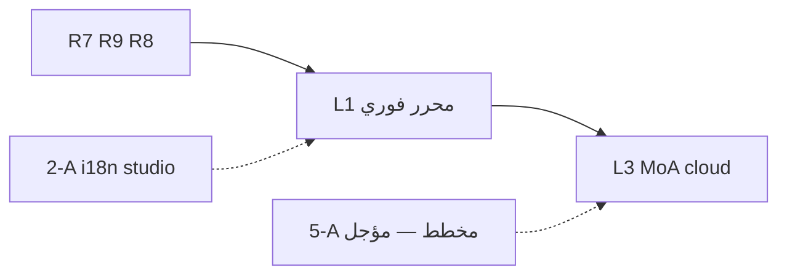

# مخطط عربية — خطة محرك «لغوي» الذكي (أفكار المالك → تنفيذ لاحق)

**تاريخ:** 22 أغسطس 2026  
**الحالة:** 📋 **تخطيط معتمد للدمج في الخطة — التنفيذ لاحقاً بموافقة**  
**الخطة الأم:** [`project-audit-and-roadmap.md`](./project-audit-and-roadmap.md) · **R1**  
**العمليات:** [`arabya-contabo-recovery-constitution-ar.md`](./arabya-contabo-recovery-constitution-ar.md)  
**بوابات R7–R2:** [`ops-r7-r8-r9-r2-playbook-ar.md`](./ops-r7-r8-r9-r2-playbook-ar.md)

---

## 0) قرار التخطيط (مهم)

| البند | القرار |
|--------|--------|
| **الآن** | توثيق وترتيب الأفكار فقط — **لا برمجة محرك جديد** |
| **لاحقاً** | تنفيذ على **موجات** بعد إغلاق R7/R9 واستقرار Sentry |
| **المنصة** | دمج داخل **`arabya.org/lughawi`** + **`arabya-nlp` (:8092)** — **ليس** تطبيق Streamlit منفصل على port 80 |
| **Contabo-first** | القواعد المحلية + NLP sidecar = الأساس؛ HF/GitHub = **تسريع اختياري** |
| **Ollama** | **opt-in** بموافقة صريحة فقط (RAM/CPU) |

---

## 1) المشكلة اليوم (من تجربتك)

| الألم | السبب التقني | الهدف |
|--------|--------------|--------|
| التصحيح **بطيء** بعد الضغط | كل طلب = round-trip سيرفر + NLP | تصحيح **فوري** أثناء الكتابة |
| القواعد **ضعيفة** | Py/TS rules فقط | طبقة client قوية + طبقة سحابية عميقة عند الطلب |
| لا يشبه Word/Google | محرر textarea + زر | **محرر ذكي**: خط تحت الخطأ + قائمة اقتراحات + «اقتراح مخصص» |

---

## 2) الرؤية — محرر نصوص ذكي (مثل Word / Google Docs)

### 2.1 تجربة المستخدم (UX) — P0 في الخطة

1. **أثناء الكتابة** (debounce ~50–150ms):
   - خط أحمر/أزرق تحت الكلمة/العبارة
   - قائمة اقتراحات (1–5) + **«اقتراح آخر…»** (حقل فارغ يكتب فيه المستخدم تصحيحه)
2. **قبول/رفض** اقتراح → يُسجَّل في **flywheel** (تعلم جماعي)
3. **زر «تدقيق عميق»** (اختياري): يفعّل المستويات السحابية (MoA) — ليس كل keystroke
4. **مؤشر الطبقة**: «قواعد فورية» · «ذاكرة لغوي» · «وكلاء سحابيون» · «قواعد احتياطية»

### 2.2 تقنية المحرر (بحث + دمج — تنفيذ لاحق)

| الطبقة | تقنية مقترحة | أين تعمل |
|--------|--------------|----------|
| **فوري client** | محرر rich-text (TipTap / ProseMirror / CodeMirror 6) + WASM أو JS rules | المتصفح |
| **قاموس/قواعد** | توسيع `@/lib/lughawi` rules + hunspell-style lists | bundle client + cache |
| **تدقيق عميق** | `POST /api/lughawi/proofread` → `arabya-nlp` | Contabo |
| **MoA سحابي** | sidecar Python أو gateway في `arabya-nlp` | Contabo → HF/GitHub API |

**مكتبات مفتوحة للاطلاع (لا commit الآن):**
- ProseMirror / TipTap (محرر + decorations للخط تحت الكلمة)
- LanguageTool (Java — **server**؛ نسخة browser محدودة)
- nspell / hunspell (قواميس)
- `@codemirror/lang-arabic` + lint plugin

**قاعدة:** التصحيح **أثناء الكتابة** = **client-first**؛ السيرفر **لا** يُستدعى على كل حرف.

---

## 3) المعمارية — 4 مستويات (Waterfall) — كما طلبت

```text
المستخدم يكتب
    │
    ├─► [Client] قواعد + قاموس فوري (0–50ms)
    │
    └─► زر «تدقيق عميق» أو auto-batch
            │
            ▼
    ┌─ Tier 1 ─ Cloud MoA (4 نماذج + قاضٍ) — مفاتيح المنصة الدوّارة
    ├─ Tier 2 ─ BYOK مفتاح المستخدم
    ├─ Tier 3 ─ محلي: قواعد + Ollama cache (semantic) — Contabo
    └─ Tier 4 ─ قواعد ثابتة فقط — لا شاشة خطأ أبداً
```

### 3.1 Tier 1 — النماذج السحابية الأربعة (بالأسماء والمسارات)

| # | الدور | Model ID (Hugging Face) | ملاحظة |
|---|--------|-------------------------|--------|
| 1 | **فصاحة عربية أصيلة** | `inceptionai/jais-30b-chat-v3` | يتطلب **Accept license** يدوياً على HF |
| 2 | **قواعد والتزام** | `meta-llama/Llama-3.3-70B-Instruct` | Meta license |
| 3 | **استدلال/تحليل** | `deepseek-ai/DeepSeek-V3` | رخصة DeepSeek |
| 4 | **القاضي والمدمج** | `Qwen/Qwen2.5-72B-Instruct` | افتراضي — **قرارك:** DeepSeek-R1 كقاضٍ؟ |

**مرونة السقوط:** 1–3 نماذج قد تفشل → القاضي يدمج **المتاح فقط**.

**مصادر API مجانية/بديلة (تسريع — اختياري):**
- Hugging Face Inference (Serverless) — token `hf_…`
- GitHub Models — PAT من GitHub
- **لا** نعتمد عليها وحده — fallback دائم لـ Tier 3–4

### 3.2 Tier 2 — BYOK (مفتاح المستخدم)

- موجود جزئياً في `/admin/ops` — **توسيع** لوحة مفاتيح المستخدم في `/account` أو `/lughawi/settings`
- رصيد منفصل — لا يُشارك مع ال pool العام

### 3.3 Tier 3 — محلي هجين (Contabo)

| المكوّن | السلوك |
|---------|--------|
| **قواعد TS/Py** | فوري — Hamza، إلى/إلى، تاء مربوطة، … |
| **Ollama** | **Shadow Agent**: تسجيل + **cache دلالي** — **لا** inference ثقيل على كل طلب |
| **flywheel.db** | SQLite: `original` · `corrected` · `user_action` · `tier` · `model_context` |

**حماية RAM (12GB):** Ollama = نموذج **صغير** quantized (Qwen2.5-1.5B / Llama-3-8B) + `timeout=5s` + `nice -n 15`

### 3.4 Tier 4 — خط الدفاع

- نفس مسار القواعد الحالي — **لا 503** للزائر

---

## 4) Mixture of Agents (MoA) + القاضي + الظل (Ollama)

### 4.1 التدفق

1. **Proposers** (Jais + Llama + DeepSeek) → 3 مسودات (parallel, timeout 4s each)
2. **Judge** (Qwen) → نص نهائي + **Self-correction loop** (مراجعة ثانية — اختياري P1)
3. **Shadow (Ollama)** → يسجّل فقط في Tier 1–2؛ يقود في Tier 3

### 4.2 Flywheel (عجلة التعلم)

| حدث | يُحفظ |
|-----|--------|
| تصحيح MoA | original + outputs + judge + tier |
| قبول/رفض مستخدم | `user_action: approved/rejected/custom` |
| تشابه >90% لاحقاً | **cache hit** — Tier 3 بدون API |

**Few-shot للقاضي:** آخر 2–3 تصحيحات ناجحة من DB في system prompt.

---

## 5) إدارة المفاتيح — لوحة تحكم (بدون لمس كود)

**طلبك:** واجهة كاملة في حسابك لإضافة مفاتيح وبيانات كل مفتاح.

### 5.1 أين في عربية (ليس Streamlit منفصل)

| الشاشة | الدور |
|--------|--------|
| **`/admin/ops` → المفاتيح** | Super Admin: pool مفاتيح HF/GitHub، حالة، فشل، تدوير |
| **`/lughawi/settings` أو `/account`** | مستخدم: BYOK + مسرد مصطلحات شخصي (P2) |

### 5.2 حقول كل مفتاح (UI)

- Label (مثل «HF حساب 3»)
- Provider: `huggingface` | `github_models` | `google` | …
- Token (مشفّر SQLite Contabo)
- حالة: active / exhausted / disabled
- `failure_count` · `last_used` · `requests_today` (تقدير)

### 5.3 التدوير التلقائي

- Round-robin على المفاتih النشطة
- عند **429** → تعطيل 60 دقيقة → مفتاح تالي
- **تنبيه** في `/admin/ops` عند نفاد 80% من ال pool

### 5.4 حسابات HF متعددة

**تقنياً:** ممكن pool بعدد N tokens.  
**تجاري/قانوني:** راجع [شروط Hugging Face](https://huggingface.co/terms-of-service) — تجاوز الحصة بحسابات وهمية قد يُخالف ToS. **الخطة:** نذكر البديل الشرعي: HF Pro / pay-as-you-go / GitHub Models / BYOK.

---

## 6) موجات التنفيذ (لاحقاً — بعد موافقتك)

| موجة | المحتوى | معيار النجاح |
|------|---------|--------------|
| **L0** | إصلاح UX: debounce + spinner + «طبقة المعالجة» | `/lughawi` أوضح |
| **L1** | **محرر TipTap/ProseMirror** + خط تحت الكلمة + اقتراحات client | يشبه Word للأخطاء الشائعة |
| **L2** | flywheel SQLite + تسجيل accept/reject | بيانات تتجمع |
| **L3** | MoA Tier 1 في `arabya-nlp` + 4 model IDs | تدقيق عميق يعمل |
| **L4** | Key pool UI في `/admin/ops` | تضيف مفتاحاً بدون PuTTY |
| **L5** | Tier 3 Ollama cache (**بموافقة**) | fallback بدون سحابة |
| **L6** | API SaaS / Business (مؤجل) | — |

**لا نبدأ L3+ قبل:** R7 ✅ · ARABYA-4 ✅ · Rocket Loader Off (R8) موصى به

---

## 7) أفكار تجارية (مؤجّلة — في الخطة فقط)

- **Lughawi for Business** — API مدفوع لاحقاً
- **مسرد شخصي** (أكاديمي/قانوني)
- **ترقية بلاغية أكاديمية** — إعادة صياغة (ليس فقط إملاء)
- **اشتراكات:** مجاني = rules + cache + كوتا MoA؛ Premium = MoA غير محدود

*(الفوترة مؤجّلة في `docs/DEVELOPMENT.md`)*

---

## 8) benchmark.py — ترقية النماذج (فكرتك)

- أسبوعياً: 50 جملة «ذهبية» عربية
- مقارنة model IDs جديدة vs الحالية
- **لا** auto-swap في production بدون موافقة — تقرير في `/admin/ops` فقط

---

## 9) قرارات مطلوبة منك (قبل أي تنفيذ)

| # | السؤال | الافتراض في الخطة |
|---|--------|-------------------|
| 1 | القاضي: **Qwen** أم **DeepSeek-R1**؟ | Qwen 2.5 72B |
| 2 | تفعيل **Ollama** على Contabo؟ | لا — حتى Tier 3 |
| 3 | **4 نماذج** كاملة أم 3 proposers + judge؟ | 4 كما وصفت |
| 4 | auto-batch سحابي أثناء الكتابة؟ | **لا** — زر «تدقيق عميق» فقط |
| 5 | multi-account HF rotation؟ | pool أدمن — **ضمن ToS** |

---

## 10) ما **لا** نفعله (حتى لا نخرج عن عربية)

- ❌ Streamlit منفصل على port 80 بجانب Next
- ❌ استدعاء HF على **كل keystroke**
- ❌ تفعيل Ollama 70B على CPU 12GB للجميع
- ❌ إزالة CSP `unsafe-inline` قبل R2 (انظر playbook)
- ❌ hardcode tokens في Git

---

## 11) تحضيرك قبل موجة L3 (عندما توافق)

1. حساب Hugging Face + **Accept** على Jais و Llama  
2. إنشاء tokens `hf_…` (Read) — **لا ترسلها في الدردشة**  
3. (اختياري) GitHub PAT لـ GitHub Models  
4. إضافة أول مفتاح عبر **`/admin/ops`** بعد بناء L4 — أو `.env` Contabo بموافقة

---

## 12) الأولوية مقابل باقي الخطة



| الأولوية | المسار | السبب |
|----------|--------|--------|
| **1** | R7 + Sentry + R8 Rocket Loader | استقرار + ARABYA-3 |
| **2** | **L1** محرر فوري client | ألمك اليومي الأكبر |
| **3** | L2–L4 MoA + keys UI | بعد L1 |
| **4** | i18n studio 2-A | جودة en — parallel |
| **5** | 5-A مخطط | مؤجل بقرارك |
| **6** | R2 CSP nonces | بعد استقرار JS |

---

*هذه الوثيقة تُحدَّث عند كل جلسة تخطيط. التنفيذ يبدأ فقط بعبارة موافقة صريحة من المالك على موجة محددة (L0, L1, …).*
