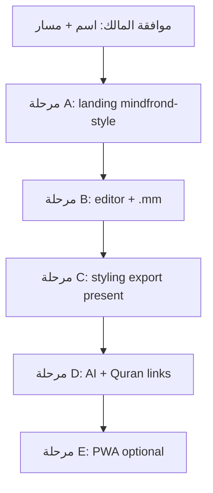

# خطة دمج MindFrond في عربية — مرجع تحليلي (MindFrond → مخطط عربية)

> **مصدر الحقيقة للتنفيذ:** [`project-audit-and-roadmap.md`](./project-audit-and-roadmap.md) §7  
> **المواصفات التقنية:** [`mukhtat-arabya-spec-ar.md`](./mukhtat-arabya-spec-ar.md)  
> **الاسم المعتمد:** **مخطط عربية** — مسار مقترح `/mukhtat`

تاريخ: 2026-08-22  
مصادر مراجعَة:
- الموقع: https://mindfrond.com/
- المصدر: `MindFrond-1.13.3-source.zip` (Freeplane + rebranding + AI plugin) — GPL v2+
- مسار المالك المحلي: `C:\Users\drmoh\Downloads\MindFrond-1.13.3-source` (نفس محتوى ZIP الرسمي)

---

## 1) ماذا اكتشفنا؟ (مهم للمالك)

| الطبقة | التقنية | الحجم/الطبيعة |
|--------|---------|----------------|
| **الموقع التسويقي** mindfrond.com | HTML/CSS ثابت (~44KB) + PostHog/Meta Pixel | **سهل نسبياً** — نُ reproduce في Next.js |
| **التطبيق الفعلي** MindFrond 1.13.3 | **Freeplane** (Java 21, Gradle, Swing, OSGi) | **~2579 ملف Java** — تطبيق **سطح مكتب** وليس موقعاً |
| **الذكاء الاصطناعي** | `freeplane_plugin_ai` (LangChain4j, Ollama, OpenRouter, MCP) | plugin Java — لا يعمل في المتصفح مباشرة |
| **ملفات الخرائط** | `.mm` (XML Freeplane/FreeMind) | معيار — **يمكن** استيراد/تصدير في الويب |

**الخلاصة الصادقة:** «يبدو **تماماً** مثل mindfrond.com **بكامل الخصائص**» = هدف **مرحلي على مراحل**، وليس دمجاً واحداً خلال أيام.  
- **الصفحة التسويقية + تجربة ويب للخرائط** → واقعية في عربية (Contabo).  
- **نسخة سطح المكتب حرفياً داخل المتصفح** (Groovy، Swing، كل plugins) → **غير واقعية** بدون إعادة كتابة ضخمة أو JVM في السحابة.

---

## 2) رؤية المنتج في عربية

**اسم الخدمة (معتمد):** **مخطط عربية** — مسار مقترح `/mukhtat` (يُثبَّت قبل المرحلة 5-A).

**التمييز عن MindFrond:**
- هوية **teal + RTL عربية** (مثل بقية المنصة)
- حفظ على **حساب Google** (SQLite Contabo) — اختياري للضيف (تصدير محلي)
- ربط عقد الخريطة بـ **قرآن / حديث / تراث / جذور** (Word IDs) — قيمة لا يقدمها MindFrond
- AI عبر **بوابة لغوي/Auto الحالية** (Contabo-first) — لا OpenRouter إلزامي

**ما لا نكسره:** المصحف، لغوي، الاستوديو، المكتبة — خدمة جديدة **بالتوازي**.

---

## 3) مصفوفة الخصائص (MindFrond → عربية)

| خاصية MindFrond | الأولوية | نهج التنفيذ في عربية | المرحلة |
|-----------------|----------|----------------------|---------|
| Hero + features + compare + FAQ + download | P0 | صفحة Next `/maps` بتصميم MindFrond + tokens عربية | **A** |
| بناء خريطة (Enter/Insert/F2، سحب، طي) | P0 | محرر ويب (React Flow أو jsMind+) + اختصارات لوحة | **B** |
| Outline بجانب الخريطة | P0 | panel RTL متزامن | **B** |
| ملاحظات + attributes + tags | P1 | JSON على العقدة + UI dock | **B–C** |
| Formulas `=6*7` | P2 | parser بسيط أو تأجيل | **C** |
| ألوان / أيقونات / edges / clouds | P1 | styling panel + CSS variables `--brand` | **C** |
| Conditional styles | P3 | تأجيل | **D** |
| بحث + فلاتر | P1 | فهرس client-side | **C** |
| Presentation mode | P2 | fullscreen step-through | **C** |
| Groovy scripting | **لا للويب** | Desktop-only أو «scripts عربية» لاحقاً | — |
| تصدير PDF/HTML/PNG/SVG/OPML | P1 | server/API + client canvas | **C** |
| استيراد `.mm` / OPML | P0 | parser XML Freeplane subset | **B** |
| 25+ لغة UI | P2 | next-intl (ar/en أولاً) | **A–B** |
| AI chat على الخريطة | P1 | ربط `/api/lughawi` + study context | **D** |
| Offline desktop | P3 | **اختياري:** PWA + IndexedDB (ليس installer Windows) | **E** |
| بدون حساب (MindFrond) | — | **ضيف:** تحرير + تصدير `.mm`؛ **حفظ سحابي:** Google | قرار منتج |

---

## 4) معمارية تقنية مقترحة (Contabo)

```text
المتصفح (RTL)
  → /maps              صفحة تسويق (مثل mindfrond.com)
  → /maps/editor/[id]  المحرر
  → POST /api/maps/... CRUD + import/export
  → Next.js (arabya-web)
  → SQLite user-data (خرائط JSON + blobs .mm)
  → (اختياري) export PDF عبر headless — **ثقيل**؛ نبدأ PNG/SVG client-side
```

**لا** نضع Freeplane JVM على Contabo في المرحلة الأولى (RAM + GPL + صيانة).  
**نعم** نستخدم **تنسيق `.mm`** للتبادل مع MindFrond/Freeplane Desktop.

---

## 5) مراحل التنفيذ (بوابات موافقة)

### المرحلة A — واجهة تسويقية (1–2 دفعات PR)
- [ ] `ArabyaMapsLanding` — hero، diagram SVG، `#features`، `#compare`، `#faq`
- [ ] ترجمة ar/en في `messages/*.json`
- [ ] CTA: «افتح المحرر» + «حمّل .mm نموذج»
- [ ] **لا** Meta Pixel إلا بموافقة؛ PostHog اختياري
- **تحقق:** يطابق structurally mindfrond.com على desktop/mobile RTL

### المرحلة B — محرر MVP
- [ ] نموذج عقدة + حفظ JSON
- [ ] استيراد/تصدير `.mm` (قراءة Freeplane XML — اختبار على maps من MindFrond)
- [ ] Outline sync
- [ ] ضيف: localStorage؛ مسجّل: SQLite عبر API
- [ ] Hub shell (teal) متسق مع PR #183/#184
- **تحقق:** إنشاء خريطة، حفظ، إعادة فتح، export `.mm` يفتح في MindFrond Desktop

### المرحلة C — خصائص متقدمة
- [ ] styling، notes، attributes، tags
- [ ] search/filter، presentation
- [ ] PNG/SVG/OPML export
- [ ] ربط عقدة ↔ `/mushaf/...` / `/hadith/...`

### المرحلة D — AI + تكامل منصة
- [ ] «وسّع هذه الفرع» عبر Auto/قواعد
- [ ] MCP-style tools **داخل عربية** (ليس Java MCP)
- [ ] بطاقة في `/services` + قسم الرئيسية

### المرحلة E — (اختياري بعيد)
- [ ] PWA offline
- [ ] JVM headless لـ PDF identical to Freeplane (فقط إن طلب المالك + موارد Contabo)

---

## 6) GPL v2+ — ما يجب أن يعرفه المالك

- MindFrond / Freeplane **GPL v2+**.
- إن **نسخنا** كود Java إلى المستودع → التزامات GPL (نشر المصدر، نفس الرخصة).
- **النهج الآمن لعربية:**  
  - **لا** vendor كود Freeplane داخل `arabya-web` في البداية.  
  - محرر ويب **من الصفر** + **parser `.mm`** (قراءة format spec).  
  - نُ offer «متوافق مع MindFrond Desktop» للتبادل — ليس fork للتطبيق.
- إذا أراد المالك **fork رسمي** لاحقاً → مستودع منفصل + صفحة `/maps/source` بالنص GPL.

---

## 7) ما نحتاجه من المالك (قبل المرحلة B)

1. **اسم الخدمة** العربي النهائي (خرائط؟ مخطط؟ فكر؟)
2. **مسار URL** (`/maps`؟)
3. **حفظ سحابي:** إلزami login أم ضيف كافٍ في MVP؟
4. **AI على الخريطة:** نعم في MVP أم مرحلة D؟
5. **رفع ZIP** (اختياري): إذا أردت نسخ assets من `MindFrond-1.13.3-source` للمرجع — أو نعتمد ZIP من mindfrond.com (تم تنزيله للتحليل).

---

## 8) ترتيب العمل مقابل خطط عربية الحالية

| الأولوية | البند | الحالة |
|----------|-------|--------|
| ✅ | Contabo Gate A + batch 2 ops | منجز 2026-08-22 |
| ✅ | Hub UI (#183–#185) | منجز |
| **التالي المقترح** | **MindFrond A — landing** | بانتظار موافقة اسم/مسار |
| لاحق | MindFrond B — editor MVP | |
| مفتوح | قرار لغوي/Auto (الدستور) | |
| مفتوح | CSP H-03 | |

---

## 9) مخطط مراحل (mermaid)



---

## 10) مطلوب منك الآن

1. **اسم الخدمة** و**المسار** (`/maps`؟).
2. **ابدأ المرحلة A** (صفحة تسويق فقط) — نعم/لا.
3. هل تريد **ربط Desktop MindFrond** (تحميل installer Windows) أم **ويب فقط**؟

---

*تحليل المصدر: Freeplane Gradle multi-project + `freeplane_plugin_ai`; الموقع: HTML static. ZIP الرسمي: https://mindfrond.com/downloads/MindFrond-1.13.3-source.zip*
