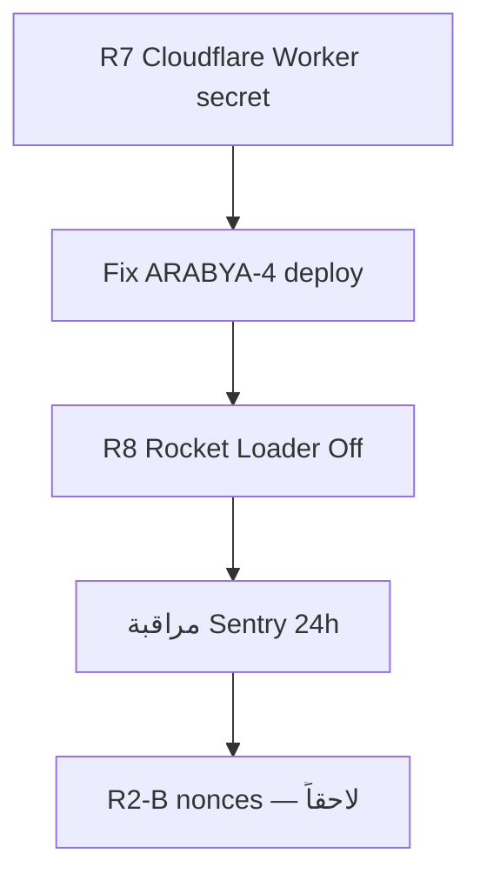

# دليل العمليات — R7 · R8 · R9 · R2 (خطوات المالك + الوكيل)

**تاريخ:** 22 أغسطس 2026  
**الخطة الأم:** [`project-audit-and-roadmap.md`](./project-audit-and-roadmap.md) §5  
**الإنتاج:** Contabo + Cloudflare أمام `arabya.org` — **لا Vercel**

---

## ملخص سريع

| # | البند | من ينفّذ | خطورة | الحالة |
|---|--------|---------|--------|--------|
| **R7** | secrets Cloudflare (wrangler) | **المالك** (لوحة Cloudflare) | متوسطة | ✅ **المالك أكمل** — تحقق وكيل: `/admin` admin CRM |
| **R9** | Sentry 24h + إصلاح الأخطاء | الوكيل (كود) + **المالك** (مراقبة) | منخفضة–متوسطة | 🟡 **ARABYA-4 منشور** — راقب 24h |
| **R8** | SFTP + Rocket Loader | **المالك** فقط | منخفضة (Pre-Launch) | ✅ Rocket Loader Off (المالك) · SFTP ⏳ اختياري |
| **R2** | CSP بدون `unsafe-inline` | **وكيل + مالك** على مراحل | **عالية** (صفحة بيضاء) | ⏸ **الخطوة 5 — مؤجّل** (انظر §الخطوة 5) |

**صلاحية Cloudflare للوكيل:** **لا** — لا يوجد وصول MCP/Token لـ Cloudflare في بيئة الوكيل. كل خطوات R7/R8/R2 في Cloudflare = **من طرفك** بالخطوات المرقّمة؛ الوكيل يجهّز الكود ويختبر Contabo بعد موافقتك.

---

## R7 — secrets Cloudflare (Worker `arabya-sync`)

### ماذا تغيّر؟
أُزيلت عناوين الأدمن من Git في #186. المتغير `ARABYA_ADMIN_EMAILS` يجب أن يكون **Secret** في Cloudflare — ليس في المستودع.

### خطواتك (مرّة واحدة — ~10 دقائق)

1. افتح: https://dash.cloudflare.com  
2. اختر الحساب → **Workers & Pages**  
3. افتح Worker **`arabya-sync`**  
4. **Settings** → **Variables and Secrets**  
5. تحت **Secrets** (ليس Variables العادية):
   - **Add secret**
   - الاسم: `ARABYA_ADMIN_EMAILS`
   - القيمة: قائمة بريدك/فريق الأدمن مفصولة بفاصلة، مثال:  
     `you@gmail.com,editor@gmail.com`
6. **Deploy** أو **Save** — تأكد أن النسخة المنشورة تحمل السر  
7. **تحقق:** من `/admin` سجّل دخول Google — حسابك يظهر كـ admin في CRM

### مرجع الكود
`workers/arabya-sync/wrangler.toml` — تعليق فقط، بدون قيم.

### إن فشل التحقق
- تأكد أن البريد **نفس** بريد Google OAuth  
- راجع Logs للWorker في Cloudflare → **Logs** → Real-time

---

## R9 — Sentry (مراقبة + إصلاح)

### الأخطاء الحالية (لقطة 22 Aug)

| ID | الخطأ | المسار | التفسير | الإجراء |
|----|--------|--------|---------|---------|
| **ARABYA-4** | `localeCompare` على `undefined` | `/adhkar/duas` | بيانات أذكار/override بدون `categoryAr` | ✅ **منشور** `93b94d5` — `localeCompareSafe` |
| **ARABYA-2** | `Connection closed` | `/:locale` | انقطاع أثناء بث SSR (زائر، bot، أو نشر أثناء الطلب) | مراقبة بعد كل deploy؛ R8 Rocket Loader |
| **ARABYA-3** | `clientReferenceManifest` | `/contact` | غالباً **Rocket Loader** أو deploy متداخل | R8 أولاً؛ ثم مراقبة |

### خطواتك اليومية (5 دقائق)

1. https://sentry.io → مشروع **arabya**  
2. **Issues** → **Unresolved** → Last 24 hours  
3. إن ظهر **Escalating** (مثل ARABYA-2): أبلغ الوكيل بالرابط  
4. بعد deploy: افتح `/adhkar/duas` و `/contact` — تأكد لا crash في المتصفح

### خطوات الوكيل بعد merge إصلاح ARABYA-4
- Deploy Contabo  
- انتظر 24h — تأكد ARABYA-4 **لا أحداث جديدة**  
- Resolve في Sentry إن توقف

---

## R8 — SFTP + Rocket Loader (Pre-Launch)

### أ) Rocket Loader (Cloudflare) — **يُنصح قبل R2**

**لماذا:** قد يكسر سكربتات Next ويسبب `clientReferenceManifest` (ARABYA-3).

1. https://dash.cloudflare.com  
2. النطاق **`arabya.org`** (كرّر لـ `arabyaai.com` إن مفعّل)  
3. **Speed** → **Optimization**  
4. **Rocket Loader™** → **Off**  
5. **Caching** → **Purge Everything** (مرّة واحدة بعد التغيير)  
6. **تحقق:** `/contact` · `/lughawi` · `/mushaf/1` — لا صفحة بيضاء

### ب) SFTP — تدوير كلمة المرور

**لماذا:** تقرير تدقيق أغسطس — كلمة قد تكون ظهرت في سياق قديم.

1. ServerAvatar → السيرفر Contabo  
2. **SFTP / FTP Accounts**  
3. **Change password** للحساب المستخدم (أو أنشئ حساب **قراءة فقط** لـ `/var/www/arabya-web`)  
4. **لا** ترسل كلمة المرور في الدردشة — احفظها في مدير كلمات مرور  
5. حدّث PuTTY/FileZilla بالكلمة الجديدة

---

## R2 — CSP و `unsafe-inline` (⚠️ خطر صفحة بيضاء)

### الوضع الحالي
`next.config.ts` يتضمن `'unsafe-inline'` في `script-src` **عمداً** — بدونه ظهرت صفحة بيضاء على Contabo (#157).

**ما جاهز للمرحلة القادمة:**
- `/public/theme-boot.js` — سكربت ثيم **خارجي** (لا inline)
- تعليقات في `layout.tsx` تشير لإزالة inline لاحقاً

### ❌ ما لا نفعله الآن
- إزالة `'unsafe-inline'` دفعة واحدة — **مرفوض** بدون بوابة اختبار

### خطة المراحل (بعد موافقتك)

| مرحلة | ماذا | من | تحقق Contabo |
|-------|------|-----|--------------|
| **R2-A** | Rocket Loader **Off** (R8) | مالك | `/contact` `/lughawi` |
| **R2-B** | nonces في middleware + `script-src 'nonce-…'` | وكيل | `/mushaf/1` study tabs |
| **R2-C** | إزالة `'unsafe-inline'` تدريجياً | وكيل | **كل** الصفحات الحرجة |
| **R2-D** | `'strict-dynamic'` إن لزم | وكيل | regression e2e |

### خطواتك في R2-A فقط (الآن — آمن)
نفس خطوات Rocket Loader في R8 أعلاه.

### صلاحيات Cloudflare للوكيل
**لا** — R2-A و R8 يحتاجان لوحة Cloudflare منك.

---

## ترتيب التنفيذ الموصى به

1. **R7** (10 د) — secret Worker  
2. **merge إصلاح Sentry ARABYA-4** + Contabo deploy  
3. **R8 Rocket Loader Off**  
4. **R9** — 24h مراقبة  
5. **R2** — فقط بعد استقرار (3) و (4)

---

## الخطوة 5 — R2 CSP (مراجعة 22 Aug — ✅ الحل الصحيح = التأجيل)

**ما طلبته:** التأكد من «حل» الخطوة 5.

**القرار:** الخطوة 5 **ليست** إزالة `unsafe-inline` اليوم — ذلك **يكسر** الموقع (تجربة #157). الحل المعتمد:

| البند | الحالة | ملاحظة |
|--------|--------|--------|
| **R2-A** Rocket Loader Off | ✅ (المالك) | يقلل ARABYA-3 (`clientReferenceManifest`) |
| **R2-B** nonces في middleware | ⏳ لاحقاً | بعد 24h Sentry بدون تصاعد |
| **R2-C** إزالة `unsafe-inline` | ⏳ لاحقاً | regression على **كل** الصفحات الحرجة |
| **`unsafe-inline` الآن** | ✅ **يبقى عمداً** | `next.config.ts` — لا تغيير حتى R2-B |

**تحقق وكيل 22 Aug (بعد merge #191):**

| فحص | النتيجة |
|------|---------|
| Deploy Contabo | ✅ نجاح — SHA **`93b94d5`** ظاهر في HTML الإنتاج |
| `/adhkar/duas` | ✅ HTTP 200 — لا `__next_error__` |
| `/contact` · `/lughawi` · `/mushaf/1` | ✅ HTTP 200 |
| `POST /api/lughawi/proofread` | ✅ 200 + JSON |
| `npm run test` | ✅ 417 اختبار |

**مطلوب منك (R9):** Sentry → Issues → 24h — إن توقف ARABYA-4 → Resolve. إن استمر ARABYA-3 → أبلغ الوكيل.

---

*يُحدَّث هذا الملف عند إغلاق كل بند في §5 الخطة الأم.*
