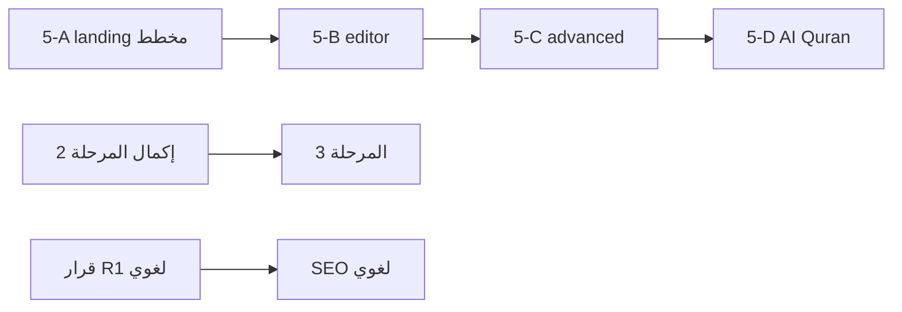

# خطة عربية: المراجعة والطريق القادم (مصدر الحقيقة)

**تاريخ التحديث:** 22 أغسطس 2026  
**المالك:** موافق على اسم الخدمة **«مخطط عربية»** — مسار مقترح `/mukhtat` (يُثبَّت قبل المرحلة 5-A).

---

## كيف تستخدم هذه الوثيقة

| السؤال | أين الجواب |
|--------|------------|
| ما الذي **انتهى**؟ | §3 + §4 |
| ما الذي **يحتاج مراجعة/فحص**؟ | §5 |
| ما **الخطوات القادمة** بالترتيب؟ | §6 |
| تفاصيل **مخطط عربية** (MindFrond)؟ | §7 + `docs/plans/mukhtat-arabya-spec-ar.md` |
| Contabo / أمان / لغوي؟ | `docs/plans/arabya-contabo-recovery-constitution-ar.md` |
| اللغات والموبايل؟ | `docs/plans/i18n-and-mobile.md` |
| ما مؤجّل في المنتج؟ | `docs/DEVELOPMENT.md` |

**قاعدة:** أي ميزة جديدة تُضاف هنا **قبل** البرمجة — حتى لا نخرج عن الخطة.

---

## 1) رؤية المنتج (ثابتة)

عربية = منصة **تحليل نص عربي كلمة بكلمة** (قرآن الآن · حديث · تراث بالتوازي) + أدوات (لغوي، استوديو، أذكار، …) + **مخطط عربية** (خرائط ذهنية ويب).

- **الإنتاج:** Contabo فقط (`arabya.org`) — لا Vercel.
- **القراءة للضيف:** بدون حساب (مصحف/دراسة).
- **الحسابات:** Google OAuth؛ الفوترة مؤجّلة.
- **هوية UI:** teal + RTL.

---

## 2) ملخص تنفيذي — كل المسارات

| # | المسار | الحالة | ملاحظة |
|---|--------|--------|--------|
| 0 | تثبيت الأساس (اختبارات، build، storage-keys) | ✅ **مكتمل** | |
| 1 | ترتيب كود الدراسة (تقسيم مصحف، API، domain) | ✅ **مكتمل** | |
| 2 | تعدد لغات الواجهة (next-intl) | 🟡 **جزئي** | `[locale]` + ar/en موجود؛ لم يُترجم كل السطح |
| 3 | تطبيق موبايل (Capacitor → Flutter) | ⏸ **لم يبدأ** | بعد استقرار 2 |
| 4 | توسع لاحق (كتب مرخّصة، Claims، بلاغة) | ⏸ **مؤجّل** | |
| **C** | Contabo + استقرار + ops | ✅ **مكتمل** (22 Aug) | Gate A، backup، deploy |
| **H** | Hub/UI موحّد (#183–#185) | ✅ **مكتمل** | hubs + تفاصيل + 404 |
| **S** | أمان التطبيق (#182) | ✅ **مكتمل** | أدمن، مكتبة، JWT، sync |
| **5** | **مخطط عربية** (MindFrond → ويب) | 🟢 **معتمد — لم يُبنَ** | §7 |
| — | قرار لغوي/Auto/Ollama | 🔴 **قرار مالك** | الدستور |
| — | CSP H-03 (nonces) | 🔴 **مراجعة لاحقة** | خطر صفحة بيضاء |
| — | SEO لغوي (نص تسويقي) | ⏸ **بانتظار نص** | |

---

## 3) ما تم إنجازه (تفصيل)

### المرحلة 0 — تثبيت الأساس ✅
- CI: lint → test → validate-data → build → (e2e)
- `storage-keys` موحّد
- تحذيرات junction Worker
- Deploy Contabo تلقائي بعد merge

### المرحلة 1 — كود الدراسة ✅
- تقسيم مكونات المصحف
- كاش تفسير مشترك
- عميل API + `src/domain`
- Media Session للصوت

### Contabo والعمليات ✅ (أغسطس 2026)
| البند | PR / مرجع |
|--------|-----------|
| حماية كود (#182) | أدمن، مسارات مكتبة، JWT 60s، Banned، sync |
| Hub + 404 + خدمات رئيسية (#183) | `ArabyaHubShell`، `HomeServicesSection` |
| صفحات تفاصيل Hub (#184–#185) | hadith، heritage، asma، root، books |
| Gate A على السيرفر | `.env` 600، `127.0.0.1:8092`، UFW بدون 8092 |
| `contabo-backup-sqlite.sh` + cron 03:15 | WAL + gzip |
| `restart-platform.sh`، `contabo-gate-a-harden.sh` | #186 |
| `contabo-recover-web.sh` | طوارئ 503 |

### محتوى ومنتج (موجود ويعمل)
- مصحف + دراسة كلمة + تفاسير + ترجمات
- hadith hub + تراث hub (Git JSON)
- لغوي (قواعد Contabo)
- استوديو، أذكار، qibla، جذور، أسماء، …
- حساب Google + `/admin/ops`

### next-intl 🟡 (بداية المرحلة 2)
- مسارات `[locale]`، ar/en في `messages/`
- **لم يُكتمل:** ترجمة كل صفحات المصحف/الدراسة؛ مزامنة تفضيلات اللغة

---

## 4) المراحل الأصلية — ما تبقى منها

### المرحلة 2 — تعدد لغات الواجهة (متبقي)
1. [ ] مراجعة تغطية الترجمة (قائمة صفحات غير مترجمة)
2. [ ] ترجمة شريط المصحف وأوضاع الدراسة
3. [ ] مزامنة تفضيل لغة الواجهة للحساب
4. [ ] لغات واجهة إضافية (id, tr, ur) — بعد استقرار ar/en

**لا نترجم:** نص المصحف العثماني، محتوى الإعراب القرآني.

### المرحلة 3 — موبايل (لم يبدأ)
1. Capacitor بعد استقرار المرحلة 2
2. Flutter لاحقاً إن لزم

### المرحلة 4 — توسع (مؤجّل)
- كتب إعراب مرخّصة، Claims، بلاغة، تحسينات صوت

---

## 5) ما يحتاج إعادة مراجعة وفحص ⚠️

| # | البند | لماذا | الإجراء المطلوب |
|---|--------|--------|-----------------|
| R1 | **قرار لغوي/Auto** | رسالة صفراء، Ollama في `.env` | قرار مالك: قواعد فقط vs opt-in LLM |
| R2 | **CSP H-03** | `unsafe-inline` ما زال في script-src | بوابة منفصلة + اختبار Contabo |
| R3 | **ESLint** | `Link` غير مستخدم في `study/page.tsx` | تنظيف PR صغير |
| R4 | **تغطية i18n** | المرحلة 2 غير مكتملة رسمياً | audit صفحات vs `messages/` |
| R5 | **صفحات تفاصيل أخرى** | library، mushaf، studio — خارج Hub | قرار: هل نُدخلها Hub؟ (حالياً **لا**) |
| R6 | **cron قديم** | أُزيل `cp` البسيط — تأكد backup 03:15 | ✅ فحص 22 Aug — OK |
| R7 | **wrangler admin emails** | أُزيلت من Git (#186) | تأكيد secrets في Cloudflare dashboard |
| R8 | **SFTP / Rocket Loader** | Pre-Launch | خطوات مالك عند الموافقة |
| R9 | **Sentry 24h** | مراقبة بشرية | المالك من `/admin/ops` |
| R10 | **PR #187** | خطة مخطط (دمج pending) | دمج ثم المرحلة 5-A |
| R11 | **Dependabot #18/#19/#69** | actions bump | اختياري — بعد موافقة |
| R12 | **مخطط — مسار URL** | `/mukhtat` مقترح فقط | تأكيد مالك قبل 5-A |

---

## 6) الخطوات القادمة — بالترتيب الموصى به

### الآن (بعد موافقة الاسم)
1. **دمج PR #187** — دمج خطة مخطط في المستودع (هذا الملف + spec).
2. **تأكيد مسار URL** — `/mukhtat` أو بديل.
3. **بدء المرحلة 5-A** — landing «مخطط عربية» (مثل mindfrond.com، teal RTL).

### قصير المدى (توازي آمن)
4. **R3** — ESLint cleanup.
5. **R4** — audit i18n وخطة إكمال المرحلة 2.
6. **R1** — قرار لغوي/Auto (يفكّ حظر batch لغوي SEO).

### متوسط المدى
7. **المرحلة 5-B** — محرر MVP + `.mm` import/export.
8. **المرحلة 5-C** — styling، export، presentation.
9. **R2** — CSP عند جاهزية nonces.

### طويل المدى
10. **المرحلة 5-D** — AI + ربط قرآn/حديث.
11. **المرحلة 3** — Capacitor.
12. **المرحلة 5-E** — PWA offline (اختياري).

---

## 7) المرحلة 5 — مخطط عربية (معتمد)

**الاسم:** مخطط عربية  
**المسار المقترح:** `/mukhtat` (محرر: `/mukhtat/editor/[id]`)  
**المرجع التقني:** Freeplane/MindFrond 1.13.3 — **لا** port Java؛ محرر وeb + `.mm`  
**التفاصيل الكاملة:** `docs/plans/mukhtat-arabya-spec-ar.md`

### 5-A — صفحة تسويق (P0) — **التالي**
- [ ] Hero + diagram + `#features` + `#compare` + `#faq`
- [ ] ar/en؛ CTA «افتح المحرر»
- [ ] بطاقة في `/services` + (لاحقاً) الرئيسية
- **لا** Meta Pixel بدون موافقة

### 5-B — محرر MVP (P0)
- [ ] عقد + حفظ (ضيف: localStorage؛ حساب: SQLite API)
- [ ] import/export `.mm`
- [ ] Outline متزامن RTL
- [ ] Hub shell teal

### 5-C — متقدم (P1)
- [ ] notes، attributes، tags، styling
- [ ] search/filter، presentation
- [ ] PNG/SVG/OPML export
- [ ] ربط عقدة → `/mushaf/...` `/hadith/...`

### 5-D — AI + منصة (P1)
- [ ] توسيع فرع عبر Auto/قواعد
- [ ] أدوات داخل عربية (ليس Java MCP)

### 5-E — اختياري (P3)
- [ ] PWA offline
- [ ] PDF headless (Contabo JVM — فقط بموافقة)

### تميّز عن MindFrond Desktop
- ويب + RTL + حساب Google
- ربط Word IDs قرآn/حديث/تراث
- AI عبر Contabo/لغوي

### GPL
- لا vendor كود Freeplane في `arabya-web`؛ parser `.mm` + محرر جديد.

---

## 8) ثلاث لغات — لا تخلط (مرجع)

| النوع | مثال |
|--------|------|
| لغة الواجهة | ar / en في الهيدر |
| لغة ترجمة الكلمة | في لوحة الدراسة |
| طبعة ترجمة الآية | Saheeh، Diyanet، … |

---

## 9) قائمة تحقق قبل أي نشر كبير

- [ ] `npm run test` + build أخضر
- [ ] Deploy Contabo + فتح المسار على `arabya.org`
- [ ] لم نكسر: `/mushaf/1`، `/lughawi`، `/library`، `/studio`
- [ ] تحديث **هذا الملف** إن تغيّرت الأولويات

---

## 10) مخاطر (ثابتة)

1. ترجمة آلية لنصوص شرعية دون مراجعة  
2. كسر RTL المصحف عند LTR  
3. `next build` أثناء `next dev`  
4. port Freeplane Java إلى Contabo بدون موافقة RAM/مالك  
5. CSP صارم بدون اختبار → صفحة بيضاء  

---

## 11) وثائق فرعية

| الملف | الغرض |
|-------|--------|
| `docs/plans/mukhtat-arabya-spec-ar.md` | مواصفات مخطط + matrix MindFrond |
| `docs/plans/arabya-contabo-recovery-constitution-ar.md` | Contabo، لغوي، بوابات |
| `docs/plans/i18n-and-mobile.md` | تفاصيل المرحلة 2–3 |
| `docs/plans/platform-expansion-and-subscriptions.md` | اشتراكات (مؤجل) |
| `docs/plans/islamic-oss-four-sources-integration-ar.md` | مصادر OSS |
| `docs/DEVELOPMENT.md` | مؤجّلات المنتج |

---

*آخر نشر Contabo مرجعي: merge #186 (`4f4a3ea`). تحديث هذا القسم بعد كل deploy مهم.*
