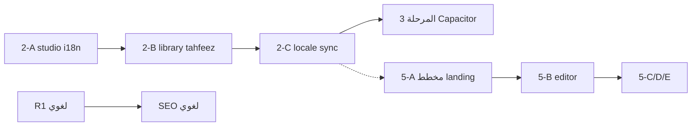

# خطة عربية: المراجعة والطريق القادم (مصدر الحقيقة)

**تاريخ التحديث:** 22 أغسطس 2026 (بعد merge #187 + R3/R4)  
**المالك:** اسم الخدمة **«مخطط عربية»** معتمد — مسار **مؤكّد:** `/mukhtat`

---

## كيف تستخدم هذه الوثيقة

| السؤال | أين الجواب |
|--------|------------|
| ما الذي **انتهى**؟ | §3 + §4 |
| ما الذي **يحتاج مراجعة/فحص**؟ | §5 |
| ما **الخطوات القادمة** بالترتيب؟ | §6 |
| تفاصيل **مخطط عربية** (MindFrond)؟ | §7 + `docs/plans/mukhtat-arabya-spec-ar.md` |
| تدقيق i18n المرحلة 2؟ | `docs/plans/i18n-phase2-audit-ar.md` |
| Contabo / أمان / لغوي؟ | `docs/plans/arabya-contabo-recovery-constitution-ar.md` |
| اللغات والموبايل؟ | `docs/plans/i18n-and-mobile.md` |
| ما مؤجّل في المنتج؟ | `docs/DEVELOPMENT.md` |

**قاعدة:** أي ميزة جديدة تُضاف هنا **قبل** البرمجة — حتى لا نخرج عن الخطة.

---

## 1) رؤية المنتج (ثابتة)

عربية = منصة **تحليل نص عربي كلمة بكلمة** (قرآن الآن · حديث · تراث بالتوازي) + أدوات (لغوي، استوديو، أذكار، …) + **مخطط عربية** (خرائط ذهنية ويب).

- **الإنتاج:** Contabo فقط (`arabya.org`) — لا Vercel.
- **القراءة للضيف:** بدون حساب (مصحف/دراسة).
- **الحسابات:** Google OAuth؛ الفوترة مؤجّلة.
- **هوية UI:** teal + RTL.

---

## 2) ملخص تنفيذي — كل المسارات

| # | المسار | الحالة | ملاحظة |
|---|--------|--------|--------|
| 0 | تثبيت الأساس (اختبارات، build، storage-keys) | ✅ **مكتمل** | |
| 1 | ترتيب كود الدراسة (تقسيم مصحف، API، domain) | ✅ **مكتمل** | |
| 2 | تعدد لغات الواجهة (next-intl) | 🟡 **جزئي** | `[locale]` + ar/en موجود؛ لم يُترجم كل السطح |
| 3 | تطبيق موبايل (Capacitor → Flutter) | ⏸ **لم يبدأ** | بعد استقرار 2 |
| 4 | توسع لاحق (كتب مرخّصة، Claims، بلاغة) | ⏸ **مؤجّل** | |
| **C** | Contabo + استقرار + ops | ✅ **مكتمل** (22 Aug) | Gate A، backup، deploy |
| **H** | Hub/UI موحّد (#183–#185) | ✅ **مكتمل** | hubs + تفاصيل + 404 |
| **S** | أمان التطبيق (#182) | ✅ **مكتمل** | أدمن، مكتبة، JWT، sync |
| **5** | **مخطط عربية** (MindFrond → ويب) | 🟡 **معتمد — 5-A مؤجّل** | §7 |
| — | قرار لغوي/Auto/Ollama | 🔴 **قرار مالك** | الدستور |
| — | CSP H-03 (nonces) | 🔴 **مراجعة لاحقة** | خطر صفحة بيضاء |
| — | SEO لغوي (نص تسويقي) | ⏸ **بانتظار نص** | |

---

## 3) ما تم إنجازه (تفصيل)

### المرحلة 0 — تثبيت الأساس ✅
- CI: lint → test → validate-data → build → (e2e)
- `storage-keys` موحّد
- تحذيرات junction Worker
- Deploy Contabo تلقائي بعد merge

### المرحلة 1 — كود الدراسة ✅
- تقسيم مكونات المصحف
- كاش تفسير مشترك
- عميل API + `src/domain`
- Media Session للصوت

### Contabo والعمليات ✅ (أغسطس 2026)
| البند | PR / مرجع |
|--------|-----------|
| حماية كود (#182) | أدمن، مسارات مكتبة، JWT 60s، Banned، sync |
| Hub + 404 + خدمات رئيسية (#183) | `ArabyaHubShell`، `HomeServicesSection` |
| صفحات تفاصيل Hub (#184–#185) | hadith، heritage، asma، root، books |
| Gate A على السيرفر | `.env` 600، `127.0.0.1:8092`، UFW بدون 8092 |
| `contabo-backup-sqlite.sh` + cron 03:15 | WAL + gzip |
| `restart-platform.sh`، `contabo-gate-a-harden.sh` | #186 |
| `contabo-recover-web.sh` | طوارئ 503 |

### محتوى ومنتج (موجود ويعمل)
- مصحف + دراسة كلمة + تفاسير + ترجمات
- hadith hub + تراث hub (Git JSON)
- لغوي (قواعد Contabo)
- استوديو، أذكار، qibla، جذور، أسماء، …
- حساب Google + `/admin/ops`

### next-intl 🟡 (بداية المرحلة 2)
- مسارات `[locale]`، ar/en في `messages/`
- **لم يُكتمل:** ترجمة كل صفحات المصحف/الدراسة؛ مزامنة تفضيلات اللغة

---

## 4) المراحل الأصلية — ما تبقى منها

### المرحلة 2 — تعدد لغات الواجهة (متبقي — تدقيق R4 منجز)

**تقرير التدقيق:** `docs/plans/i18n-phase2-audit-ar.md`

1. [x] مراجعة تغطية الترجمة — **22 Aug:** 1779 مفتاح ar/en متطابق؛ 64/79 صفحة i18n؛ فجوة رئيسية: استوديو
2. [ ] **موجة 2-A:** استوديو ayat-studio → `useTranslations("Studio")`
3. [ ] **موجة 2-B:** مكتبة + تسميع
4. [x] شريط المصحف وأوضاع الدراسة — **مغطّى** (`Mushaf` · `Study` · `WordDock`)
5. [ ] **موجة 2-C:** مزامنة `uiLocale` عبر `/api/sync`
6. [ ] **موجة 2-E:** لغات إضافية (id, tr, ur) — بعد استقرار ar/en

**لا نترجم:** نص المصحف العثماني، محتوى الإعراب القرآني.

### المرحلة 3 — موبايل (لم يبدأ)
1. Capacitor بعد استقرار المرحلة 2
2. Flutter لاحقاً إن لزم

### المرحلة 4 — توسع (مؤجّل)
- كتب إعراب مرخّصة، Claims، بلاغة، تحسينات صوت

---

## 5) ما يحتاج إعادة مراجعة وفحص ⚠️

| # | البند | لماذا | الإجراء المطلوب |
|---|--------|--------|-----------------|
| R1 | **قرار لغوي/Auto** | رسالة صفراء، Ollama في `.env` | قرار مالك: قواعد فقط vs opt-in LLM |
| R2 | **CSP H-03** | `unsafe-inline` ما زال في script-src | بوابة منفصلة + اختبار Contabo |
| R3 | **ESLint** | `Link` غير مستخدم في `study/page.tsx` | ✅ أُزيل 22 Aug |
| R4 | **تغطية i18n** | المرحلة 2 غير مكتملة رسمياً | ✅ تدقيق + خطة موجات — `i18n-phase2-audit-ar.md` |
| R5 | **صفحات تفاصيل أخرى** | library، mushaf، studio — خارج Hub | قرار: هل نُدخلها Hub؟ (حالياً **لا**) |
| R6 | **cron قديم** | أُزيل `cp` البسيط — تأكد backup 03:15 | ✅ فحص 22 Aug — OK |
| R7 | **wrangler admin emails** | أُزيلت من Git (#186) | تأكيد secrets في Cloudflare dashboard |
| R8 | **SFTP / Rocket Loader** | Pre-Launch | خطوات مالك عند الموافقة |
| R9 | **Sentry 24h** | مراقبة بشرية | المالك من `/admin/ops` |
| R10 | **PR #187** | خطة مخطط | ✅ دُمج `f4284be` — Deploy Contabo OK |
| R11 | **Dependabot #18/#19/#69** | actions bump | ⏸ مؤجّل — اختياري |
| R12 | **مخطط — مسار URL** | `/mukhtat` | ✅ **مؤكّد من المالك** 22 Aug |

---

## 6) الخطوات القادمة — بالترتيب الموصى به

### ✅ منجز (22 Aug)
1. ~~دمج PR #187~~ — خطة مخطط في المستودع (`f4284be`)
2. ~~تأكيد `/mukhtat`~~ — مسار مؤكّد
3. ~~R3 ESLint~~ — تنظيف `study/page.tsx`
4. ~~R4 i18n audit~~ — `docs/plans/i18n-phase2-audit-ar.md`

### الآن (أولوية التنفيذ)
5. **موجة 2-A** — i18n استوديو الفيديو (أكبر فجوة en)
6. **موجة 2-B** — i18n مكتبة + تسميع
7. **موجة 2-C** — sync `uiLocale` للحساب

### ⏸ مؤجّل (قرار مالك 22 Aug)
8. **5-A landing مخطط** — صفحة تسويق `/mukhtat` (حتى إشعار آخر)
9. **R1 قرار لغوي/Auto** — يفكّ حظر SEO لغوي
10. **5-B → 5-E مخطط** — محرر ويب بعد 5-A
11. **R2 CSP nonces** — خطر صفحة بيضاء
12. **المرحلة 3 Capacitor** — بعد استقرار المرحلة 2
13. **R7/R8/R11** — Cloudflare secrets، SFTP، Dependabot

### ترتيب الأولوية بين المؤجّلات (6→12)

| الأولوية | البند | لماذا الآن / لاحقاً |
|----------|-------|---------------------|
| **1** | **5-A landing مخطط** | منتج جديد مرئي — مؤجّل بقرارك |
| **2** | **R1 لغوي/Auto** | يؤثر على `/lughawi` + SEO |
| **3** | **5-B محرر مخطط** | يعتمد على 5-A |
| **4** | **5-C/D/E مخطط** | بعد MVP المحرر |
| **5** | **R2 CSP** | أمان — خطر صفحة بيضاء |
| **6** | **المرحلة 3 Capacitor** | بعد ar/en مستقر |
| **7** | **R7/R8/R11** | صيانة Pre-Launch |

